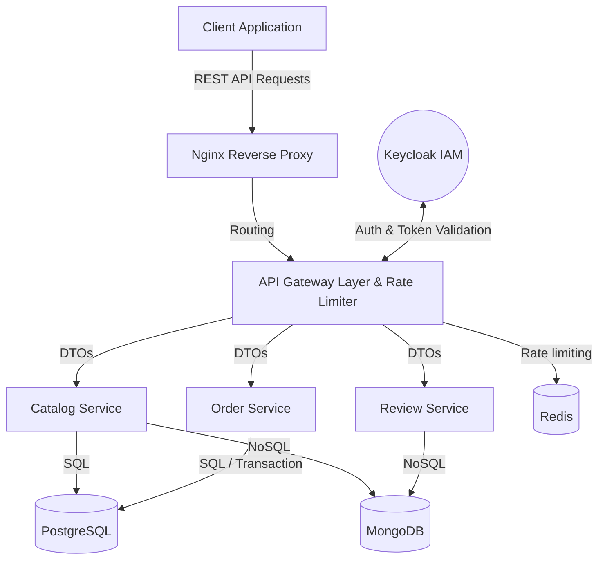

# Grailkits
> A microservice-based e-commerce marketplace dedicated to football jerseys. The system handles the entire sales process: from browsing the product catalog, through cart management and checkout, to user reviews. The architecture ensures high scalability of individual domains.

[API Specification / Swagger UI](./docs/openapi.yaml) 

## Engineering Highlights & Architecture Decisions
*This section highlights architectural decisions over basic CRUD operations.*

* **Microservices Architecture:** The project is divided into independent services (Gateway, Catalog, Order, Review), ensuring data isolation and technological independence of specific domains.
* **Polyglot Persistence:** Hybrid database architecture tailored to domain requirements:
  - Relational databases: `PostgreSQL` managed by Knex.js query builder for services requiring consistent order states and secure transactions.
  - Document databases: `MongoDB` supporting dynamically changing product detail attributes (ProductDetailMongoRepository) and flexible, schema-less review management in the Review Service.
* **Security & Authentication:** Implemented and configured the OAuth 2.0 standard. External IAM (Keycloak) handles authentication procedures using Authorization Code Flow + PKCE. A central Identity Provider manages role-based access control (User, Admin).
* **API Gateway Pattern:** A secure, single point of entry proxy protecting microservices, with built-in rate limiting and request validation, including cryptographic JWT signature verification via JWKS.

## Tech Stack
* **Language / Framework:** Node.js, Express.js (ES6+)
* **Data Layer:** PostgreSQL (Knex.js at the repository layer), MongoDB (Mongoose/Native driver), Redis (caching / rate-limiting)
* **Testing:** Jest + Supertest (isolated integration testing of endpoints / API contracts)
* **DevOps / Infra:** Docker, Docker Compose, Nginx (Reverse Proxy), Keycloak IAM.

## Architecture & System Design
*The application utilizes an architecture with separated domains using a layered approach within individual microservices (Controllers -> Services -> Repositories), emphasizing the separation of business logic from database integration.*



## Getting Started

**Prerequisites:** Docker and docker-compose installed.

```bash
# Clone the repository
git clone <repository-url>
cd <project-directory>

# Build and start all services (app + database)
docker compose up --build
```

Check `.env` files in application repositories for required environment variables mapping. The platform automatically provisions default databases during setup scripts execution (`init-test-db.sql`).

## Testing & Quality Assurance

* **Integration tests:** Core logic of endpoints and microservice availability runs over API requests via `Jest` and `Supertest`. 

```bash
# Command to run the test suite per service
cd apps/catalog-service
npm run test
```

## What I'd Improve With More Time

1. **System Events & Message Broker:** Implement an asynchronous event queue (RabbitMQ / Kafka) to exchange events (e.g., cart operations and order finalization) between _Order Service_ and _Catalog Service_ instead of potential synchronous communication.
2. **Centralized Logging:** Add an external request log and error tracking system for more efficient debugging in a distributed environment (e.g., ELK Stack: Elasticsearch, Logstash, Kibana).

## License
MIT