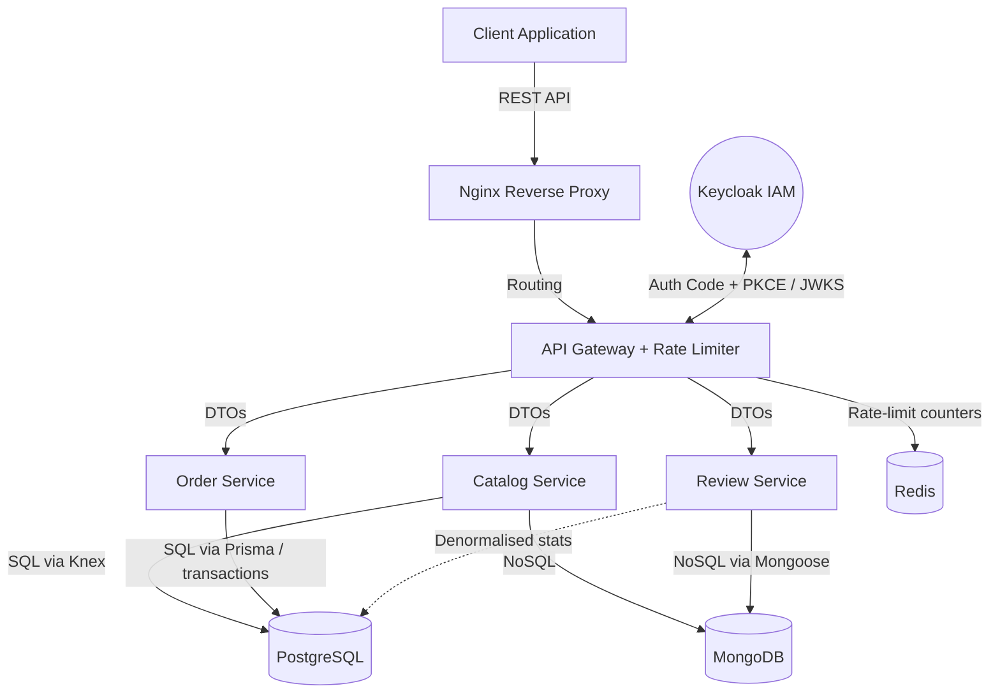

# Grailkits

> **Grailkits** is a microservice-based e-commerce marketplace for football jerseys. Independent services (Catalog, Order, Review) sit behind a shared API Gateway, each with its own logical data scope.
>
> *Note: originally built as an academic backend project.*

[OpenAPI Specification](./docs/openapi.yaml)

---

## Engineering Highlights & Architecture Decisions

* **Microservices:** Four services — Gateway, Catalog, Order, Review — each as a separate Express app with its own Dockerfile and `/health` endpoint. The Gateway is the only externally exposed entry point.
* **Polyglot persistence:** Database choice driven by what each domain actually needs:
  * **Catalog** — Postgres (relational core: products, categories, variants) **and** Mongo (flexible product detail attributes).
  * **Order** — Postgres only; orders/carts/payments need transactions and consistent state.
  * **Review** — Mongo for review documents (schema-less, evolving shape) plus Postgres writes for denormalised review stats.
* **Shared DB infrastructure, logical separation:** Services share a single Postgres and a single Mongo instance with per-service tables and collections. The Review service currently writes denormalised stats (`avg_rating`, `review_count`) directly to Catalog's `products` table — a deliberate shortcut for the academic scope. An event-driven version (Review publishes `ReviewApproved`, Catalog consumes and updates its own table) is listed under "What I'd Improve".
* **Auth via Keycloak:** OAuth 2.0 Authorization Code Flow + PKCE, with role-based access (User/Admin) handled by the IAM rather than custom auth code.
* **API Gateway:** Single entry point that verifies incoming JWTs against Keycloak's JWKS endpoint and applies Redis-backed rate limiting before forwarding requests to the services.
* **Operational hygiene:** Every service exposes a `/health` endpoint; Docker Compose uses `healthcheck` + `depends_on: service_healthy` so services start in the correct order, plus per-container CPU / memory limits and log rotation.

---

## Tech Stack

* **Language / Framework:** `Node.js`, `Express.js` (ES6+)
* **Postgres access:** `Knex.js` (Catalog), `Prisma` (Order), `Sequelize` + raw `pg` (Review) — three different approaches across services, kept intentionally to compare ergonomics.
* **Mongo access:** Native `mongodb` driver (Catalog), `Mongoose` (Review)
* **Caching / Rate limiting:** `Redis`
* **Testing:** `Jest`, `Supertest` (covers Catalog, Order, Review; Gateway is not yet covered)
* **DevOps / Infra:** `Docker`, `Docker Compose`, `Nginx` (reverse proxy), `Keycloak` IAM

---

## System Architecture



---

## Getting Started

**Prerequisites:** Docker and Docker Compose installed.

```bash
git clone https://github.com/jakub-jurkian/grailkits
cd grailkits
cp .env.example .env   # adjust DB/Mongo/Redis credentials if needed
docker compose up --build
```

The setup script `docker/init-test-db.sql` provisions default schemas automatically on first run. The gateway is exposed via the reverse-proxy container on `http://localhost`.

---

## Testing

```bash
# Run the test suite for a given service
cd apps/catalog-service
npm test
```

`Catalog`, `Order`, and `Review` use `Jest` + `Supertest`. Mongo-backed tests in the `Review` service use `mongodb-memory-server` for isolation.

---

## What I'd Improve With More Time

1. **Event-driven cross-service communication:** Introduce a message broker (RabbitMQ / Kafka) so Review publishes `ReviewApproved` events that Catalog consumes to update product stats, instead of Review writing directly to Catalog's `products` table.
2. **One Postgres approach across services:** Consolidate the three different Postgres access patterns (Knex / Prisma / Sequelize) into one — most likely Prisma — for consistency and easier onboarding.
3. **Gateway test coverage:** Add Jest + Supertest tests for JWT validation, rate limiting, and request forwarding.
4. **Centralized logging:** Add log aggregation across services (e.g. ELK / Loki) — right now debugging a request across services means checking each service's logs separately.

---

## License
MIT
