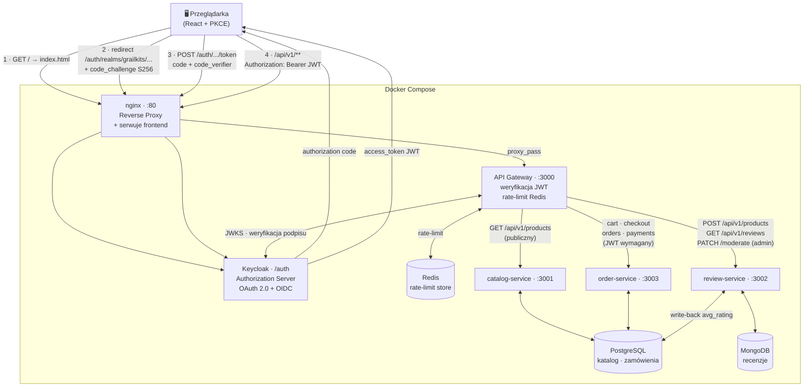

# GrailKits — Marketplace koszulek piłkarskich - część README dla przedmiotu bezpieczeństwo aplikacji webowych

**Imię i nazwisko:** Jakub Jurkian
**Grupa:** 2

---

## Opis funkcjonalności

GrailKits to marketplace koszulek piłkarskich zbudowany w architekturze mikroserwisowej i zabezpieczony zgodnie ze standardem **OAuth 2.0 (Authorization Code Flow + PKCE)**.

### Użytkownik niezalogowany
- Przegląda listę produktów (`GET /api/v1/products`) — endpoint publiczny
- Czyta recenzje (`GET /api/v1/reviews`) — endpoint publiczny

### Użytkownik zalogowany (rola `user`)
- Loguje się przez Keycloak z PKCE (S256) — frontend generuje `code_verifier` i `code_challenge`, wymienia kod na JWT
- Dodaje produkty do koszyka (`POST /api/v1/cart/lines`) — wymaga tokenu JWT
- Składa zamówienie (`POST /api/v1/checkout`) — wymaga tokenu JWT
- Wystawia recenzję (`POST /api/v1/reviews`) — wymaga tokenu JWT; recenzja trafia w stan `PENDING`

### Administrator (rola `admin`)
- Zatwierdza lub odrzuca recenzje (`PATCH /api/v1/reviews/:id/moderate`) — wymaga tokenu JWT **i** roli `admin`; inni użytkownicy dostają `403 Forbidden`

### Zabezpieczenia w gateway
- Weryfikacja JWT przez JWKS endpoint Keycloak (biblioteka `jose`)
- Rate limiting oparty na Redis (100 req / 15 min per IP)
- Endpointy `/api/v1/cart`, `/api/v1/orders`, `/api/v1/checkout`, `/api/v1/payments` — w pełni chronione
- Mutacje na produktach i recenzjach — chronione; odczyty — publiczne
- `/health` — publiczny (health check)

---

## Diagram komunikacji



---

## Instrukcja uruchomienia

### Wymagania

- Docker Desktop (z włączonym Docker Compose v2)
- Git

### 1. Sklonuj repozytorium

```bash
git clone <url-repo>
cd grailkits
```

### 2. Utwórz plik `.env`

```bash

cp .env.example .env
```

### 3. Uruchom system

```bash
docker compose up --build -d
```

Pierwsze uruchomienie zajmuje ~2 minuty (migracje, seedy, start Keycloak).

### 4. Skonfiguruj Keycloak

Wejdź na `http://localhost/auth/admin` → zaloguj się `admin` / `admin`.

**a)** Przełącz realm z `master` na **`grailkits`** (lewy górny róg).

**b)** Clients → `grailkits-frontend` → Settings:
- **Valid redirect URIs:** dodaj `http://localhost/callback`
- Zapisz.

**c)** Realm roles → Create role → utwórz `admin` i `user`.

**d)** Users → Create new user → podaj username → Save.  
Zakładka **Credentials** → Set password (wyłącz Temporary).  
Zakładka **Role mapping** → Assign role → wybierz `admin` lub `user`.

### 5. Otwórz aplikację

```
http://localhost
```

### Tryb deweloperski (hot-reload dla gateway)

```bash
docker compose up -d      # override.yml dołączany automatycznie
```

Zmiany w `apps/gateway/src/` są wykrywane przez `nodemon` bez rebuildu obrazu.

### Zatrzymanie

```bash
docker compose down       # dane zostają w named volumes
docker compose down -v    # dane usunięte
```

Frontend jest zrobiony minimalnie, jego jedynym celem jest zademonstrowanie mechanizmów bezpieczeństwa, nie pełna aplikacja sklepowa.
frontend pokazuje:
- logowanie przez Keycloak z PKCE
- publiczny widok (ProductList bez tokenu)
- chroniony widok (CartPanel wymaga tokenu)
- widok ograniczony rolą (AdminPanel tylko dla admina)
- operacja z kontrolą roli (Approve/Reject wysyła PATCH z tokenem, gateway sprawdza rolę admin)

Co nie jest pokazane w UI, choć backend to obsługuje:
- lista zatwierdzonych/odrzuconych recenzji
- historia zamówień (GET /api/v1/orders)
- szczegóły zamówienia
- historia płatności

Te endpointy działają poprawnie i są zabezpieczone, po prostu nie ma do nich widoków w React.


Koniec opisu na przedmiot bezpieczeństwo aplikacji webowych, niżej jest oryginalne README do całego projektu
---

E-commerce backend for limited football kits. API Gateway + three domain microservices, PostgreSQL for catalog / orders / payments, MongoDB for product details and reviews.

## Architecture

```
                        Client
                          |
                          v
                     Gateway :3000
             /            |            \
            v             v             v
        Catalog        Review          Order
        Service        Service         Service
        :3001          :3002           :3003
       /       \      /       \       /       \
      v         v    v         v     v         v
  PostgreSQL  MongoDB  MongoDB  PostgreSQL  PostgreSQL  PostgreSQL
  (pg+Knex)  (native  (Mongoose (pg write- (Sequelize)  (Prisma)
  categories  driver)  reviews)  back:      orders/      Payment/
  products   product_           avg_rating  cart)        PaymentEvent
  variants   details)
```

| Service | Responsibility |
|---------|----------------|
| `gateway` | Public entry point and reverse proxy; routes `/api/v1/products/*`, `/api/v1/reviews/*`, `/api/v1/orders/*`, `/api/v1/cart/*`, `/api/v1/checkout`, `/api/v1/payments/*` to downstream services |
| `catalog-service` | Categories, products, and variants in PostgreSQL (pg + Knex); product details (long description, specs map, image gallery) in MongoDB via the native driver; full-text search via `$text` |
| `review-service` | Review submission, moderation queue, analytics aggregation pipeline; writes `avg_rating` + `review_count` back to PostgreSQL on approval, with compensation if the PG write fails |
| `order-service` | Cart management, checkout with pessimistic locking, order lifecycle (create, cancel with stock compensation); Payment domain owned by Prisma (`Payment` + `PaymentEvent`) with real schema-creating migrations |

## Tech Stack

| Layer      | Technology |
|------------|------------|
| Runtime    | Node.js 20 + Express 5 |
| PostgreSQL | `pg` (raw pool + error code mapping 23505/23503 → 409/400) in catalog-service and review-service; **Knex 3** in catalog-service (schema migrations, dynamic where, seeds); **Sequelize v6** in order-service (orders / cart / cart_lines, managed transactions, pessimistic locking via raw `SELECT ... FOR UPDATE`); **Prisma 6** in order-service (typed CRUD on `Payment`/`PaymentEvent`, managed `$transaction`, tagged-template `$queryRaw`) |
| MongoDB    | MongoDB native driver (`product_details` collection in catalog-service — singleton `MongoClient`, SIGINT close, `$eq`/`$in`/`$text`/`$set` operators, unique index on `productId`, text index on `longDescription`); Mongoose 9 (`reviews` in review-service — custom validators, pre-save hook, statics, virtual populate, aggregation pipeline with `$match`/`$group`/`$project`/`$lookup`) |
| Infra      | Docker, Docker Compose, PostgreSQL 16, MongoDB 7, multi-stage Dockerfiles, healthchecks with `depends_on: service_healthy` |

## API Routes

Full specification: [`docs/openapi.yaml`](docs/openapi.yaml) (OpenAPI 3.0.3). All routes served through the gateway at `http://localhost:3000`.

Quick reference:

| Method | Path | Description |
|--------|------|-------------|
| GET    | `/api/v1/products` | List products with dynamic filters (categoryId, minPrice, maxPrice, available) |
| GET    | `/api/v1/products/:id` | Product detail (Knex+pg + Mongo enrichment) |
| GET    | `/api/v1/products/count` | Total product count |
| GET    | `/api/v1/products/categories` | List categories |
| GET    | `/api/v1/products/search?q=…` | Full-text search via Mongo `$text` |
| POST   | `/api/v1/products` | Create product (hybrid PG + Mongo with compensation) |
| PATCH  | `/api/v1/products/:id/details` | Patch Mongo doc via `$set` with strict whitelist |
| POST   | `/api/v1/cart/lines` | Add variant to cart (stock check) |
| GET    | `/api/v1/cart` | Get open cart |
| POST   | `/api/v1/checkout` | Checkout with `FOR UPDATE` row lock |
| GET    | `/api/v1/orders` | Order history (by `X-User-Id`) |
| GET    | `/api/v1/orders/:id` | Order detail (with ownership check) |
| POST   | `/api/v1/orders/:id/cancel` | Cancel + restore stock |
| POST   | `/api/v1/orders/:id/payment` | Create Payment in PENDING (Prisma) |
| GET    | `/api/v1/payments/:id` | Payment detail with event history (eager loading) |
| GET    | `/api/v1/payments/count?status=…` | Count payments by status (`$queryRaw`) |
| POST   | `/api/v1/payments/:id/authorize` | PENDING → AUTHORIZED (Prisma `$transaction`) |
| POST   | `/api/v1/payments/:id/fail` | PENDING → FAILED (Prisma `$transaction`) |
| POST   | `/api/v1/reviews` | Submit review (PENDING) |
| GET    | `/api/v1/reviews/product/:productId` | Reviews for product (Mongoose populate) |
| GET    | `/api/v1/reviews/approved` | All approved reviews (statics) |
| GET    | `/api/v1/reviews/analytics/avg-rating` | Aggregation pipeline (`$match` → `$group` → `$project` → `$lookup`) |
| PATCH  | `/api/v1/reviews/:id/moderate` | Moderate + hybrid PG write-back |

## Key Design Decisions

- **Pessimistic locking** — checkout uses `SELECT ... FOR UPDATE` to prevent oversell under concurrent requests.
- **Hybrid review write-back** — approving a review triggers a MongoDB `$group` aggregation and writes `avg_rating` + `review_count` back to PostgreSQL. If the PG write fails, MongoDB is reverted to `PENDING` (compensation).
- **Hybrid product creation** — `POST /api/v1/products` writes the relational row (pg) and then the document details (Mongo native driver). If the Mongo write fails, the PG row is deleted (compensation).
- **Order snapshot** — `order_items` stores `skuSnapshot` and `unitPrice` at checkout time so order history is immutable even if catalog changes.
- **Disjoint schema ownership** — three engines coexist in the order-service PostgreSQL database without conflict: Sequelize manages `orders / order_items / carts / cart_lines` via `sync({ alter: true })`; Prisma manages `Payment / PaymentEvent` via real migrations (`prisma migrate deploy` on a clean DB creates the tables on the first boot). The two sets are disjoint and `Payment.orderId` is a loose UUID without a FK at the schema level, so there is no startup ordering coupling.
- **Prices in grosz** — stored as integers (catalog variants, order `totalPrice`, order item `unitPrice`, and payment `amount`) to avoid floating-point rounding errors.

## Data Flow (PostgreSQL / MongoDB)

**PostgreSQL** stores the relational core. In catalog-service, Knex manages the schema (categories / products / variants) via migrations and seeds; the `pg` pool drives reads and the hybrid create/delete in `ProductService`. In order-service, Sequelize manages `orders` / `order_items` / `carts` / `cart_lines` with pessimistic locking (`SELECT ... FOR UPDATE`) and managed transactions; Prisma additionally manages `Payment` / `PaymentEvent` through typed CRUD with `include`, managed `$transaction`, and one tagged-template `$queryRaw` for `countByStatus`.

**MongoDB** stores documents that benefit from flexible schemas — `product_details` (long description, specs map, image gallery) and `reviews` (rating, body, moderation history). The `product_details` collection is owned and written by `catalog-service` through the **MongoDB native driver** (singleton `MongoClient` with `SIGINT` close, unique index on `productId`, text index on `longDescription`, four operators in real endpoints: `$eq`, `$in`, `$text`, `$set`); `review-service` uses **Mongoose** to manage `reviews` (custom validators, pre-save hook, statics, virtual populate of `product_details`, aggregation pipeline for analytics).

**Hybrid writes**:
- *Product creation* — pg insert (catalog-service) + Mongo `insertOne` (native driver). On Mongo failure, the pg row is deleted (compensation).
- *Review approval* — Mongoose `save` + PG `UPDATE products SET avg_rating, review_count`. On PG failure, the review status is reverted to `PENDING` in MongoDB (compensation).

## Environment Variables

| Variable | Used by |
|----------|---------|
| `PORT`                            | all services |
| `DATABASE_URL`                    | catalog-service (pg), order-service (Sequelize + Prisma), review-service (pg write-back) |
| `DB_HOST / DB_PORT / DB_USER / DB_PASSWORD / DB_NAME` | catalog-service (pg, Knex) |
| `MONGODB_URI`                     | catalog-service (native driver), review-service (Mongoose) |
| `CATALOG_SERVICE_URL`             | gateway |
| `REVIEW_SERVICE_URL`              | gateway |
| `ORDER_SERVICE_URL`               | gateway (routes both `/api/v1/orders/*` and `/api/v1/payments/*` here) |

## Running

```bash
docker compose up -d --build
docker compose ps          # check health status
docker compose logs -f     # stream all logs
```

On a clean database the boot sequence is:

1. `postgres` + `mongo` come up and pass their healthchecks.
2. `catalog-service` boots → Knex creates the catalog schema and seeds it; the MongoDB native driver creates `product_details` indexes and seeds documents.
3. `order-service` boots → **`prisma migrate deploy`** creates `Payment` and `PaymentEvent` on the empty database (real DDL, not a baseline stub); Sequelize then `sync({ alter: true })` creates its disjoint set of tables.
4. `review-service` boots → Mongoose registers schemas and seeds reviews.
5. `gateway` boots last, after every downstream service reports healthy.

## Ports

| Service         | URL                   |
|-----------------|-----------------------|
| Gateway         | http://localhost:3000 |
| Catalog service | http://localhost:3001 |
| Review service  | http://localhost:3002 |
| Order service   | http://localhost:3003 |
| PostgreSQL      | localhost:5432        |
| MongoDB         | localhost:27017       |

## Security

| Threat | Mitigation |
|--------|-----------|
| **Oversell / race condition** | `SELECT ... FOR UPDATE` (pessimistic lock) on variant row during checkout; concurrent request blocks until first commits, then re-checks stock → 409 if insufficient |
| **Broken object-level authorization** | Every order endpoint compares `X-User-Id` header to `order.userId` at service layer; mismatch → 403 before any data is returned |
| **SQL injection** | All queries use parameterised statements — Knex `.where()`, Sequelize model methods + raw queries with named replacements, Prisma typed CRUD and `$queryRaw` tagged template, `pg` prepared statements; no string concatenation with user input |
| **NoSQL injection** | Mongoose schema validation rejects undeclared fields; `productId` from params is passed as a plain string. For PATCH `/products/:id/details` the service applies a strict whitelist (`longDescription`, `specs`, `gallery`) plus per-field type checks, so Mongo query operators like `$set` or `$inc` in the request body are silently dropped before reaching the native driver |
| **XSS in review body** | Mongoose validator blocks any value containing `<`, `>`, or `<script` before save |
| **Stack trace leakage** | Controllers catch all errors and return `{ error, code, details }` — raw error objects and stack traces are never forwarded to the client |
| **Resource exhaustion via unbounded search** | `searchByText` caps result sets at 20 by default; the search endpoint also requires `q` to be at least 2 characters |

## Error Format

```json
{ "error": "message", "code": "NOT_FOUND", "details": null }
```

Codes: `BAD_REQUEST`, `UNAUTHORIZED`, `FORBIDDEN`, `NOT_FOUND`, `CONFLICT`, `UNPROCESSABLE_ENTITY`, `INTERNAL_ERROR`.
